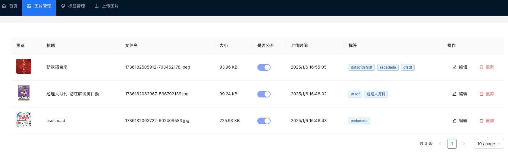
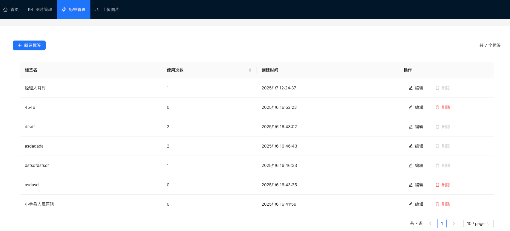
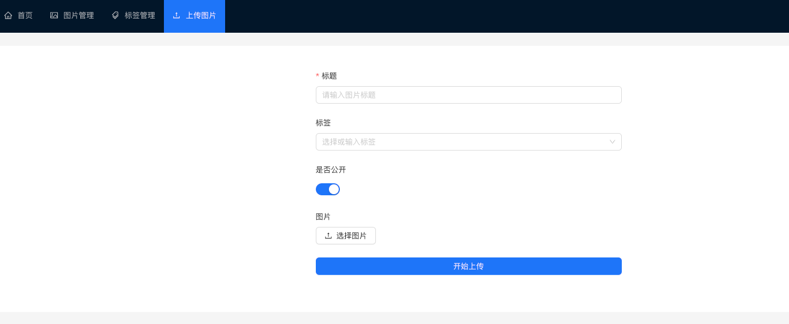

# PhotoStore - 图片管理系统

一个简单但功能完整的图片管理系统，支持图片上传、标签管理、图片搜索等功能。

[项目预览图]




## 功能特性

### 图片管理
- ✅ 图片上传
  - 支持拖拽上传
  - 上传前预览
  - 自动生成唯一文件名
  - 支持批量上传
- ✅ 图片列表展示
  - 网格/列表视图切换
  - 缩略图预览
  - 图片详细信息显示
- ✅ 图片删除
  - 单张删除
  - 批量删除
  - 删除确认机制
- ✅ 图片信息编辑
  - 标题修改
  - 标签管理
  - 公开状态切换
- ✅ 图片搜索功能
  - 按标题搜索
  - 按标签筛选
  - 实时搜索提示

[图片管理功能截图]

### 标签系统
- ✅ 标签管理
  - 创建新标签
  - 编辑标签名称
  - 删除未使用标签
  - 标签使用统计
- ✅ 智能标签功能
  - 标签自动补全
  - 标签去重处理
  - 标签名称规范化
- ✅ 标签使用限制
  - 防止删除使用中的标签
  - 标签长度限制
  - 标签数量控制

[标签管理功能截图]

### 用户界面
- ✅ 响应式设计
  - 适配桌面端
  - 适配平板设备
  - 适配移动端
- ✅ 交互优化
  - 加载状态提示
  - 操作成功/失败提示
  - 友好的错误提示
- ✅ 性能优化
  - 图片懒加载
  - 请求节流/防抖
  - 本地缓存优化

[响应式设计截图]

## 技术实现

### 前端技术栈
- React 18
  - 函数式组件
  - Hooks 状态管理
  - 自定义 Hooks
- TypeScript
  - 类型定义
  - 接口规范
  - 类型检查
- Ant Design 5
  - 组件库
  - 主题定制
  - 响应式布局
- Axios
  - 请求拦截器
  - 响应处理
  - 错误处理
- React Router
  - 路由管理
  - 路由守卫
  - 参数处理

### 后端技术栈
- Node.js
  - Express 框架
  - 中间件机制
  - 错误处理
- Express
  - 路由管理
  - 静态文件服务
  - CORS 配置
- SQLite3
  - 本地数据库
  - 事务处理
  - 外键约束
- Multer
  - 文件上传处理
  - 文件类型验证
  - 文件大小限制
## 项目结构
bash
photostore/
├── client/ # 前端代码
│ ├── src/
│ │ ├── components/ # 通用组件
│ │ │ ├── Header/ # 头部导航
│ │ │ ├── ImageList/ # 图片列表
│ │ │ └── Upload/ # 上传组件
│ │ ├── pages/ # 页面组件
│ │ │ ├── Home/ # 首页
│ │ │ ├── Manage/ # 管理页
│ │ │ └── Tags/ # 标签页
│ │ ├── services/ # API服务
│ │ ├── utils/ # 工具函数
│ │ └── types/ # 类型定义
│ └── public/ # 静态资源
└── server/ # 后端代码
├── config/ # 配置文件
├── controllers/ # 控制器
├── models/ # 数据模型
├── routes/ # 路由定义
├── utils/ # 工具函数
└── uploads/ # 上传文件存储

## 快速开始

### 环境要求
- Node.js >= 14
- npm >= 6
- SQLite3

### 安装步骤

1. 克隆项目
```bash
git clone https://github.com/yourusername/photostore.git
cd photostore
```

2. 后端设置
```bash
cd server
npm install
cp .env.example .env  # 配置环境变量
npm start
```

3. 前端设置
```bash
cd client
npm install
cp .env.example .env  # 配置环境变量
npm start
```

[安装运行截图]

## API 文档

### 图片相关接口
| 方法   | 路径                  | 描述         | 参数                    |
|--------|----------------------|--------------|------------------------|
| GET    | /api/images         | 获取图片列表   | search, page, limit    |
| POST   | /api/images/upload  | 上传图片      | file, title, tags      |
| PUT    | /api/images/:id     | 更新图片信息   | title, is_public, tags |
| DELETE | /api/images/:id     | 删除图片      | -                      |

### 标签相关接口
| 方法   | 路径                | 描述         | 参数                    |
|--------|-------------------|--------------|------------------------|
| GET    | /api/images/tags  | 获取所有标签   | -                      |
| POST   | /api/images/tags  | 创建新标签    | name                   |
| PUT    | /api/images/tags/:id | 更新标签   | name                   |
| DELETE | /api/images/tags/:id | 删除标签   | -                      |

## 开发指南

### 代码规范
- 使用 ESLint 进行代码检查
- 使用 Prettier 进行代码格式化
- 遵循 TypeScript 类型定义规范

### 提交规范
- feat: 新功能
- fix: 修复问题
- docs: 文档修改
- style: 代码格式修改
- refactor: 代码重构
- test: 测试用例修改
- chore: 其他修改

## 部署指南

### 开发环境
1. 安装依赖
2. 配置环境变量
3. 启动开发服务器

### 生产环境
1. 构建前端代码
2. 配置 Nginx
3. 启动后端服务
4. 配置 PM2

[部署架构图]

## 常见问题

### 上传相关
1. 文件大小限制：单个文件不超过 5MB
2. 支持的文件类型：jpg, jpeg, png, gif
3. 上传失败处理：自动重试，错误提示

### 标签相关
1. 标签数量限制：单个图片最多 10 个标签
2. 标签命名规范：1-50 个字符，不允许特殊字符
3. 标签删除限制：使用中的标签无法删除

## 更新日志

### v1.0.0 (2024-01-06)
- 初始版本发布
- 基础功能实现
  - 图片上传管理
  - 标签系统
  - 搜索功能
- 标签系统上线

## 贡献指南

1. Fork 项目
2. 创建特性分支 (`git checkout -b feature/AmazingFeature`)
3. 提交改动 (`git commit -m 'Add some AmazingFeature'`)
4. 推送到分支 (`git push origin feature/AmazingFeature`)
5. 创建 Pull Request

## 许可证

MIT

## 作者

[西木]

## 致谢

- Ant Design 团队提供的优秀组件库
- React 社区的技术支持
- Node.js 社区的技术支持